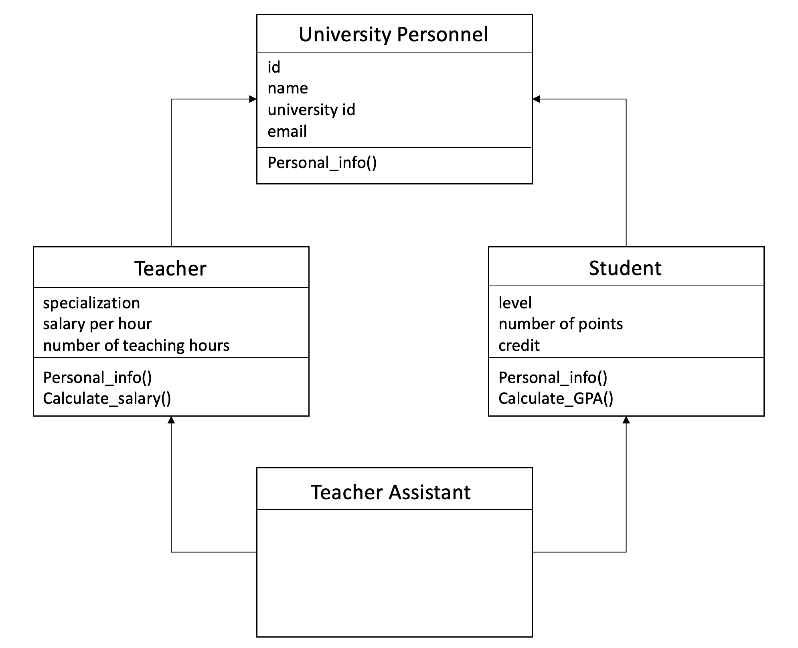

# OOP python 

Everyone in the university has a name, university number, ID number and university email.

Some people at the university are teachers. Some of them are students. These two groups of people may have different traits and behaviours.

For example:
Students have attributes like level and GPA
While teachers have other attributes such as salaries, specialization, for example

But teachers and students share common features of all university members: names, university numbers, ID numbers, and university emails.

Here is a third type, and they are teaching assistants who are at the same time teachers and students.
They study postgraduate studies and have a GPA, and at the same time they also get paid for their work in college.
 

## Write a program that combines all these three categories, as follows:

   

### Create a universty personnel class (parent class) contains:

* constroctor with:
  * `id`
  * `name`
  * `university id`
  * `university email`

* Method called `Personal_Information` which will return all that person's information.

* `Setter` and `getter` for all attributes 

 

### Create a teacher class (child class, extend from universty personnel) contains:
* Constroctor with: 
  * `specialization`
  * `salary per hour`
  * `number of teaching hours`

* `Setter` and `getter` for all attributes 

* Method for calculating the `total salary`:
Total salary =  salary per hour X tnumber of teaching hours

* Overriede personal information method in the parent's class and add to it (specialization and salary)

  

### Create a class for students (child class, extend from universty personnel) contains:

* Constroctor with: 
  * `level`
  * `number of points `
  * `credit`

* Method for calculating the `GPA`
GPA = number of points  X credit
Overriede personal information method in the parent's class and add to it  (GPA)

* `Setter` and `getter` for all attributes 

  

### Create Teaching Assistant class (child class inheriting the Student and Teacher classes)

  

Create an `instances` for students, teachers, and teaching assistants. Then called all methods for each instance. 
